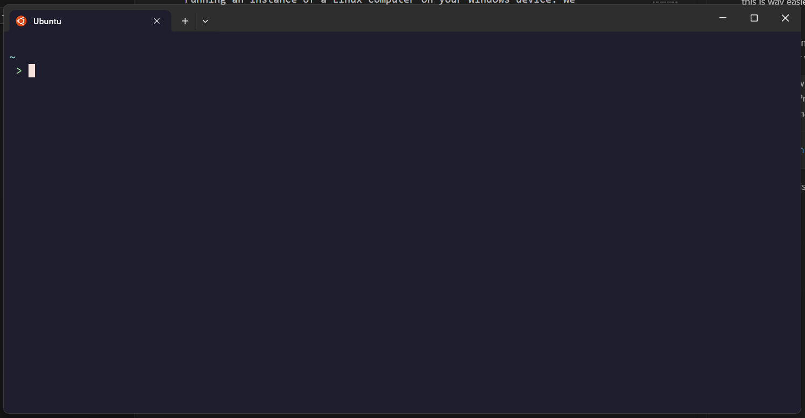

# Week 1 Assignemnt: WSL, VSCode, Terminal, Git

For this week we will be doing a lot of setup and installation work. Please reach out as soon as possible if anything isn't working as I describe and I will try to help debug once I am available.

## WSL2 (Windows Subsystem for Linux)

In general, developing in Windows is a bit of a hassle because most developer tools are written for Unix-based operating systems. You can think of this as a certain format/structure used in designing an operating system that is common to Linux systems and MacOS. Windows on the other hand is very different and makes things very difficult, so to make things easier we will use Windows Subsystem for Linux (WSL).

WSL is essentially more or less a "virtual machine." You can think of this as running an instance of a Linux computer on your Windows device. We essentially section out a portion of your computer's hardware resources and reserve them for a *Linux subsystem*, and lets us work as if we were on a Linux machine. In comparison to a choice like dual-booting, this is way easier to install, no need to reboot your computer when switching operating systems, and is well supported.

There are technically two versions of WSL, WSL1 and WSL2. The default version now is WSL2 and is just pretty much better in every way, and is what we will be using. [Here](https://learn.microsoft.com/en-us/windows/wsl/install) is an installation guide, or follow the steps below.

> You can now install everything you need to run WSL with a single command. Open PowerShell or Windows Command Prompt in administrator mode by right-clicking and selecting "Run as administrator", enter the wsl --install command, then restart your machine.
> ```PowerShell
> wsl --install
> ```

Once Ubuntu is installed, and you open it in your terminal, you should see something like this.


If you want to open another Ubuntu terminal, you can click the small downward arrow next to the + sign on the tab bar, and Ubuntu should be in the dropdown.

Now, we have access to a Ubuntu (which is a Linux distribution) shell.

## The shell

Before our computers were powerful enough to render images and graphics like our computers do now, we only had text on a screen, which we called a *terminal user interface* (TUI) in contrast to a *graphical user interface* (GUI) as we have now. Therefore, all programs in a computer back then were purely text-based: you call the program with some input, and then you get back some output text in return. The terminal is essentially a way for us to run programs in this way, and is a really powerful tool. Now that we have our Ubuntu terminal, we can complete the following exercises.

1. Type `pwd` and press enter. 
