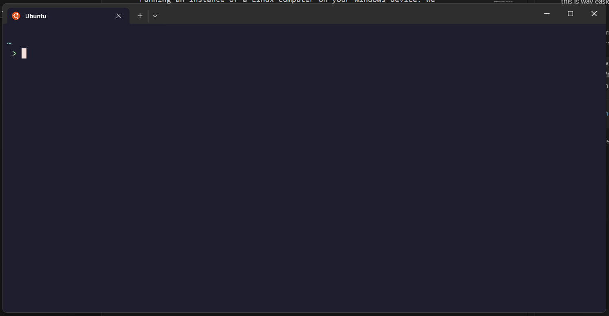
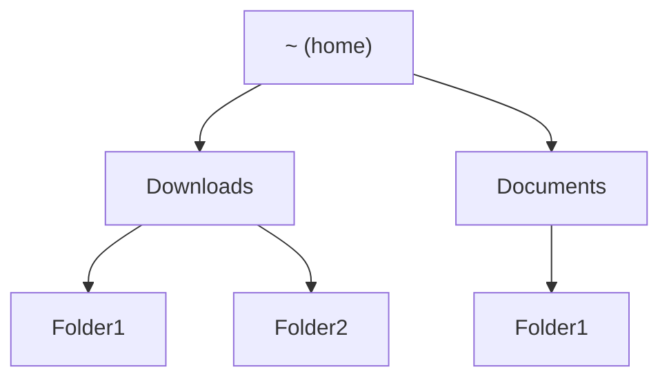
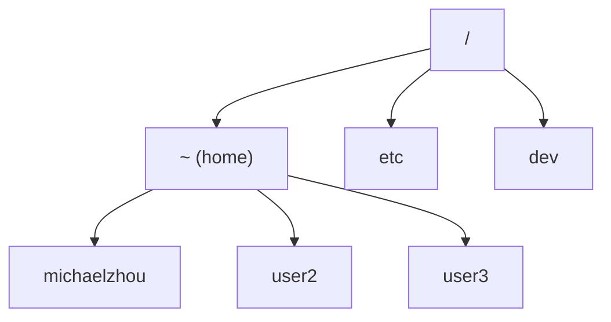

# Week 1 Assignemnt: WSL, VSCode, Terminal, Git

For this week we will be doing a lot of setup and installation work. Please reach out as soon as possible if anything isn't working as I describe and I will try to help debug once I am available.

## WSL2 (Windows Subsystem for Linux)

In general, developing in Windows is a bit of a hassle because most developer tools are written for Unix-based operating systems. You can think of this as a certain format/structure used in designing an operating system that is common to Linux systems and MacOS. Windows on the other hand is very different and makes things very difficult, so to make things easier we will use Windows Subsystem for Linux (WSL).

WSL is essentially more or less a "virtual machine." You can think of this as running an instance of a Linux computer on your Windows device. We essentially section out a portion of your computer's hardware resources and reserve them for a *Linux subsystem*, and lets us work as if we were on a Linux machine. In comparison to a choice like dual-booting, this is way easier to install, no need to reboot your computer when switching operating systems, and is well supported.

There are technically two versions of WSL, WSL1 and WSL2. The default version now is WSL2 and is just pretty much better in every way, and is what we will be using. [Here](https://learn.microsoft.com/en-us/windows/wsl/install) is an installation guide, or follow the steps below.

> You can now install everything you need to run WSL with a single command. Open PowerShell or Windows Command Prompt in administrator mode by right-clicking and selecting "Run as administrator", enter the wsl --install command, then restart your machine.
> ```PowerShell
> wsl --install
> ```

Once Ubuntu is installed, and you open it in your terminal, you should see something like this.


If you want to open another Ubuntu terminal, you can click the small downward arrow next to the + sign on the tab bar, and Ubuntu should be in the dropdown.

Now, we have access to a Ubuntu (which is a Linux distribution) shell.

## The shell

### Background 

Before our computers were powerful enough to render images and graphics like our computers do now, we only had text on a screen, which we called a *terminal user interface* (TUI) in contrast to a *graphical user interface* (GUI) as we have now. Therefore, all programs in a computer back then were purely text-based: you call the program with some input, and then you get back some output text in return. The *terminal* then, is the interface for interacting with your computer in this way. The *shell* is a program running on your computer that handles the input and output in your terminal. There are many different shell languages, among which Bash is especially common and is the one we are using in Ubuntu.

### Some basic commands

Syntax for shell commands (the input you pass to the prompt in the terminal) generally comes in the form `command arg1 arg2 arg3 ...`. This is reminiscient of us calling a function in Python for example, but notice the absence of parentheses or commas.

The first command we'll cover is `man` which stands for manual. `man` takes one argument, and provides the manual for that command.

1. Run `man pwd`. What does this tell us about `pwd`? What do you think `pwd` will do?
2. Now run `pwd`. What is the output?
3. Now try using the commands `ls` and `cd`. What do they do?

The output of `pwd` should be two strings separated by forward slashes `/`. This is essentially how we model our file tree from the terminal. While in your file explorer we can click on folders (which we call in this context directories) to navigate files, a sequence of clicks such as Documents -> Folder1 -> Folder2 -> file1.txt is now represented as `Documents/Folder1/Folder2/file1.txt`. At any point in our terminal session, there is a concept of a "current directory," which is the output of `pwd`. Notably, when we open a terminal session, we start at a special location called *home*, which is sometimes represented with a `~`.

One way to visualize our file system is as a *tree*, with `~` (home) as our root, and subdirectories as children.



But notice that if you call `pwd` in home, it actually shows something like `/home/michaelzhou`. In fact, as you may have guessed, home also has parent directories. For a given computer, there may be multiple user accounts, so *home* actually refers to the "root" for that given user. The actual root of the filesystem, which is represented by `/`, contains a bunch of administrator items, and also contains subdirectories for home for each user. So more accurately, our tree looks like follows:



Our home symbol `~` is just an alias for `/home/user`: `cd ~/Documents` is exactly the same as `cd /home/user/Documents`.

Now we introduce concepts of **relative paths** and **absolute paths**. Suppose your current working directory is `Documents`, and we're trying to switch to `Documents/Folder1`, in a file structure similar to the first diagram in this section. There are two ways to do this: either `cd Folder1`, or `cd /home/user/Documents/Folder1`. The first method uses the relative path. If we call `cd Folder1`, the shell navigates to the correct directory *relative* to the current directory we're in: since the current directory is `Documents`, we navigate to `Documents/Folder1`. If the current directory were `Downloads`, we would navigate to `Downloads/Folder1`. If the current directory were `~`, the command would fail because `~/Folder1` doesn't exist.

The second method uses the absolute path. When we start a filepath with `/`, we essentially describe the filepath directory by directory starting from the root, the very top of the file tree. In this way, there is no ambiguity even if two directories in different locations have the same name, i.e. we have `/home/user/Documents/Folder1` and `/home/user/Downloads/Folder1`. An easy way to distinguish relative paths and absolute paths is that absolute paths always begin with `/` and relative paths never do.

Some more exercises follow.

4. Run `touch temp.txt`. Which part is the command? Which part is the argument? What does the command do when the given file doesn't exist?
5. What does `mkdir` do? How do you use it?
6. What does `rm` do? How do you use it?
7. What does `mv` do? How do you use it?
7. Provide a sequence of commands and a brief description of what each command does to accomplish the following steps:

    - Create a file structure similar to the one visualized at the top of this section, i.e. under `~`, create `Documents` and `Downloads` subdirectories, with `Folder1` and `Folder2` directories beneath those as shown.
    - Change current directory to home.
    - Change current directory to `Folder1` inside of `Documents` using a single command, with a *relative path*.
    - Change current directory to `Folder1` inside of `Downloads` using a single command, with an *absolute path*.
    - Create a file called `file1.txt` inside our current directory.
    - Create `file2.txt` inside our current directory.
    - Move `file2.txt` to the parent directory.
    - Remove `file1.txt` (hint: use `man rm`)
    - Change current directory to the parent directory (i.e. `~/Downloads`) using a single relative path command (feel free to Google).
    - Remove the `Folder1` subdirectory (hint: if you get an error, try `man rm` and look for an additional argument to pass to remove directories).

## Version control: Git and Github (in progress)

### Basic Git

Like how Google Docs saves an edit history for our documents allowing us to go back to restore checkpoints at an earlier time in our document, we want to be able to do the same thing with our code projects. Hence, we use a version control system (VCS), and the most popular (and also probably effective) choice by far is Git, which is related to, but different from Github, which we will discuss later.

Unlike Google Docs, however, checkpoints are made manually instead of automatically, and is a two-step process. But first, let us initialize a *Git repository*.

First, call `mkdir -p ~/Documents/project/hw/hw1/`.

1. Quick review question: what does this command do? Is the path an absolute or relative path (this answer might be different from what you expect, recall what does `~` stand for)? What does the `-p` flag do (check the manual) and what happens if it isn't included?

Now, `cd` into the directory we just created. Call `git init` to initialize a `git` repository. Git is likely preinstalled, but if not, call `sudo apt install git` and enter your password in the prompt.

Create `file1.txt`, and `file2.txt` (use `touch`). Then, call `git status`. Your output should look similar to as follows.

```
On branch main

No commits yet

Untracked files:
  (use "git add <file>..." to include in what will be committed)
        file1.txt
        file2.txt
```

Next, call `git add file1.txt` and `git add file2.txt`. We can also abbreviate these two commands into the single `git add file1.txt file2.txt`. Now call `git status again`.
```
On branch main

No commits yet

Changes to be committed:
  (use "git rm --cached <file>..." to unstage)
        new file:   file1.txt
        new file:   file2.txt
```

Lastly, call `git commit -m "initial commit"`. The output should look similar to as follows
```
[main (root-commit) 12309ee] initial commit
 2 files changed, 0 insertions(+), 0 deletions(-)
 create mode 100644 file1.txt
 create mode 100644 file2.txt
```

If you get an error message asking you to set email and name, just follow the instructions and call.
```
git config --global user.name "Your Name"
git config --global user.email "email@example.com"
```

Now, let's call git status one more time.
```
On branch main
nothing to commit, working tree clean
```

Let's review what happened in this two step process. `git commit` is like saving a checkpoint. The "initial commit" part is a message parameter you have to pass when committing that describes what happened during that commit.

Meanwhile, `git add` includes the files you want to save in your next commit. While you may want to add all the files that you have edited, sometimes you want to exclude some files from a checkpoint, in which case you wouldn't edit that file.

Let's make another commit.

Call `echo "Hello, world!" > file1.txt` (new terminal command!). This replaces the contents of `file1.txt` with "Hello, world!". Call `cat file1.txt` to display the contents of `file1.txt` to confirm that it is "Hello, world!".

Now call `git status` again.
```
On branch main
Changes not staged for commit:
  (use "git add <file>..." to update what will be committed)
  (use "git restore <file>..." to discard changes in working directory)
        modified:   file1.txt
```

Note that we modified `file1.txt`, but not `file2.txt`, thus `file2.txt` is not displayed here since it has not changed. Let's create one more file called `file3.txt` and call `git status again`.

```
On branch main
Changes not staged for commit:
  (use "git add <file>..." to update what will be committed)
  (use "git restore <file>..." to discard changes in working directory)
        modified:   file1.txt

Untracked files:
  (use "git add <file>..." to include in what will be committed)
        file3.txt
```

Now let us *stage* some changes to commit (this is the formal term for what `git add` does). Only stage `file3.txt` with `git add file3.txt`, then commit with the message "Created file3.txt". Run `git status` again.
```
On branch main
Changes not staged for commit:
  (use "git add <file>..." to update what will be committed)
  (use "git restore <file>..." to discard changes in working directory)
        modified:   file1.txt
```

Notice that since we didn't stage our changes in `file1.txt` for our last commit, our modification has not yet been saved into a commit. Go ahead and stage and commit `file1.txt`.

Now making commits is only useful if we have a way of returning to old commits. Call `git log`
```
commit 7c64b80e24312fc76dc6d7d271d8523998b947c1 (HEAD -> main)
Author: Michael Zhou <micha.zhou@gmail.com>
Date:   Fri Jun 20 20:30:02 2025 -0700

    Edited file1.txt

commit 5098e2d13833c611e727570dbd4e250e022590b2
Author: Michael Zhou <micha.zhou@gmail.com>
Date:   Fri Jun 20 20:25:35 2025 -0700

    Created file3.txt

commit 12309eee120241212a27ae962cdff4131bd27d8b
Author: Michael Zhou <micha.zhou@gmail.com>
Date:   Fri Jun 20 20:17:03 2025 -0700

    initial commit
```

We can see each commit we made, the message we added, the time it was made, as well as a *commit hash*, which is a unique identifier for each commit. To view our code at a different commit, we can call `git checkout <hash>`, where `<hash>` can either be the full hash, or just the first 7 characters. Your hashes will be different, so adjust the commands below accordingly. Let's *checkout* the commit where we created `file3.txt`, but didn't commit our changes to `file1.txt`.
```
git checkout 5098e2d
```

Now call `ls` to confirm that we indeed have all three files, and `cat file1.txt` to confirm that it is indeed still empty. Lastly call `git checkout main` to return to our latest commit.

### Git branches

One of the most powerful tools we have available to us in Git is branches. We will discuss briefly, but not cover in detail.

Suppose two people are working on a project, and two people are assigned two different tasks. If both were to make edits at the same time, it could be disastrous, for one person's changes may affect the other person's work, and collaboration would be a disaster. Instead, we can branch off of a starting point, and each person works separately from where their branch begins. Since their branches are totally separate, their edits are only reflected on their own branch. When both branches are working properly, we can then merge the two branches together and resolve any conflicts in one go.

Branches are thus incredibly useful for collaboration, and also help significantly with organization. We won't make as much use of this feature, but it will likely be useful in your future.

One more side note: our default branch when you create a repository is called `main`. We have already seen a little bit of this when we called `git checkout main`, which meant return to our original branch. 

### Github

While Git is a utility that runs entirely on your computer, Github is a tool that helps us store our Git repositories on the cloud, and enables for collaboration across the Internet between different users and devices.

First, make a Github account: https://github.com/. This next part is going to be complicated, don't really worry about the details just try your best to follow the steps and let me know if anything doesn't work.

In your terminal (WSL Ubuntu), enter the command
```
ssh-keygen -t rsa -b 4096
```

Your terminal should prompt you with a save location. Just press return to accept the default option. You'll then be prompted to set a password for the ssh-key: just leave it blank and press return for ease.

Navigate to the location where your ssh keys were just generated (`~/.ssh`). Also quick remark, you'll notice that if you use the `ls` command in `~`, we don't see a `.ssh` subdirectory. This is because directories and files that start with a `.` are *hidden*, meaning they won't display but still exist. To see all files and directories, including hidden ones, use the `ls -a` flag.

Now that we are in `~/.ssh`, use the `ls` command. You should see `id_rsa.pub` and `id_rsa`, your public and private key respecitvely.

2. What command should you use to display the contents of `id_rsa.pub` (hint: we used this command to display the contents of a file in the Git tutorial)?

Run the above command and copy the contents to clipboard. Now on Github, click on your profile icon on the top right, click Settings, click SSH and GPG keys on the side menu, click new SSH key, then paste the contents of `id_rsa.pub`. Choose any title and add the key.

Next, we will create a repository. Click on the + button on the top right, and create a new repository with any name, preferably public. For now, don't add a README, .gitignore, or a license. In your new repository, click the green "Code" button, then click "SSH," and copy the `git@github.com:...` address. Lastly, return to your Git repository you created in the first part of this section (make sure to `cd` into it or else Git will error saying no Git repo has been initialized), and call the following command, where the last part is the address you copied above.
```
get remote add origin git@github.com:...
```

What we just did is create our first Github repository (essentially a cloud version of a Git repository), and we created a pointer called "origin" in our Git repository that points to the Github one. Now, call the following command.
```
git push origin main
```

This sends our `main` branch (which for now is our only branch), to the `origin` remote location, which we set in our prior command. If everything goes smoothly, a refresh on Github repo should show our updated repo.
