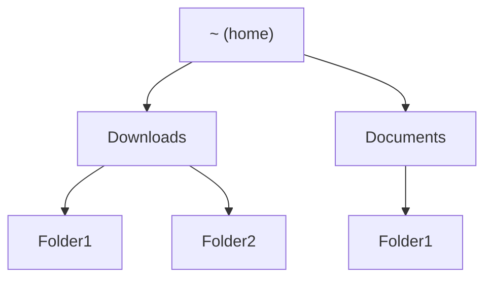
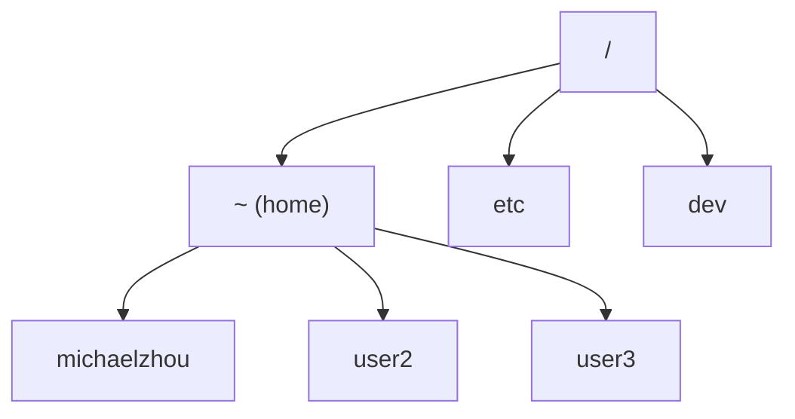

# Week 1 Assignemnt: WSL, VSCode, Terminal, Git

For this week we will be doing a lot of setup and installation work. Please reach out as soon as possible if anything isn't working as I describe and I will try to help debug once I am available.

## WSL2 (Windows Subsystem for Linux)

In general, developing in Windows is a bit of a hassle because most developer tools are written for Unix-based operating systems. You can think of this as a certain format/structure used in designing an operating system that is common to Linux systems and MacOS. Windows on the other hand is very different and makes things very difficult, so to make things easier we will use Windows Subsystem for Linux (WSL).

WSL is essentially more or less a "virtual machine." You can think of this as running an instance of a Linux computer on your Windows device. We essentially section out a portion of your computer's hardware resources and reserve them for a *Linux subsystem*, and lets us work as if we were on a Linux machine. In comparison to a choice like dual-booting, this is way easier to install, no need to reboot your computer when switching operating systems, and is well supported.

There are technically two versions of WSL, WSL1 and WSL2. The default version now is WSL2 and is just pretty much better in every way, and is what we will be using. [Here](https://learn.microsoft.com/en-us/windows/wsl/install) is an installation guide, or follow the steps below.

> You can now install everything you need to run WSL with a single command. Open PowerShell or Windows Command Prompt in administrator mode by right-clicking and selecting "Run as administrator", enter the wsl --install command, then restart your machine.
> ```PowerShell
> wsl --install
> ```

Once Ubuntu is installed, and you open it in your terminal, you should see something like this.


If you want to open another Ubuntu terminal, you can click the small downward arrow next to the + sign on the tab bar, and Ubuntu should be in the dropdown.

Now, we have access to a Ubuntu (which is a Linux distribution) shell.

## The shell

### Background 

Before our computers were powerful enough to render images and graphics like our computers do now, we only had text on a screen, which we called a *terminal user interface* (TUI) in contrast to a *graphical user interface* (GUI) as we have now. Therefore, all programs in a computer back then were purely text-based: you call the program with some input, and then you get back some output text in return. The *terminal* then, is the interface for interacting with your computer in this way. The *shell* is a program running on your computer that handles the input and output in your terminal. There are many different shell languages, among which Bash is especially common and is the one we are using in Ubuntu.

### Some basic commands

Syntax for shell commands (the input you pass to the prompt in the terminal) generally comes in the form `command arg1 arg2 arg3 ...`. This is reminiscient of us calling a function in Python for example, but notice the absence of parentheses or commas.

The first command we'll cover is `man` which stands for manual. `man` takes one argument, and provides the manual for that command.

1. Run `man pwd`. What does this tell us about `pwd`? What do you think `pwd` will do?
2. Now run `pwd`. What is the output?
3. Now try using the commands `ls` and `cd`. What do they do?

The output of `pwd` should be two strings separated by forward slashes `/`. This is essentially how we model our file tree from the terminal. While in your file explorer we can click on folders (which we call in this context directories) to navigate files, a sequence of clicks such as Documents -> Folder1 -> Folder2 -> file1.txt is now represented as `Documents/Folder1/Folder2/file1.txt`. At any point in our terminal session, there is a concept of a "current directory," which is the output of `pwd`. Notably, when we open a terminal session, we start at a special location called *home*, which is sometimes represented with a `~`.

One way to visualize our file system is as a *tree*, with `~` (home) as our root, and subdirectories as children.



But notice that if you call `pwd` in home, it actually shows something like `/home/michaelzhou`. In fact, as you may have guessed, home also has parent directories. For a given computer, there may be multiple user accounts, so *home* actually refers to the "root" for that given user. The actual root of the filesystem, which is represented by `/`, contains a bunch of administrator items, and also contains subdirectories for home for each user. So more accurately, our tree looks like follows:



Our home symbol `~` is just an alias for `/home/user`: `cd ~/Documents` is exactly the same as `cd /home/user/Documents`.

Now we introduce concepts of **relative paths** and **absolute paths**. Suppose your current working directory is `Documents`, and we're trying to switch to `Documents/Folder1`, in a file structure similar to the first diagram in this section. There are two ways to do this: either `cd Folder1`, or `cd /home/user/Documents/Folder1`. The first method uses the relative path. If we call `cd Folder1`, the shell navigates to the correct directory *relative* to the current directory we're in: since the current directory is `Documents`, we navigate to `Documents/Folder1`. If the current directory were `Downloads`, we would navigate to `Downloads/Folder1`. If the current directory were `~`, the command would fail because `~/Folder1` doesn't exist.

The second method uses the absolute path. When we start a filepath with `/`, we essentially describe the filepath directory by directory starting from the root, the very top of the file tree. In this way, there is no ambiguity even if two directories in different locations have the same name, i.e. we have `/home/user/Documents/Folder1` and `/home/user/Downloads/Folder1`. An easy way to distinguish relative paths and absolute paths is that absolute paths always begin with `/` and relative paths never do.

Some more exercises follow.

4. Run `touch temp.txt`. Which part is the command? Which part is the argument? What does the command do when the given file doesn't exist?
5. What does `mkdir` do? How do you use it?
6. What does `rm` do? How do you use it?
7. What does `mv` do? How do you use it?
7. Provide a sequence of commands and a brief description of what each command does to accomplish the following steps:

    - Create a file structure similar to the one visualized at the top of this section, i.e. under `~`, create `Documents` and `Downloads` subdirectories, with `Folder1` and `Folder2` directories beneath those as shown.
    - Change current directory to home.
    - Change current directory to `Folder1` inside of `Documents` using a single command, with a *relative path*.
    - Change current directory to `Folder1` inside of `Downloads` using a single command, with an *absolute path*.
    - Create a file called `file1.txt` inside our current directory.
    - Create `file2.txt` inside our current directory.
    - Move `file2.txt` to the parent directory.
    - Remove `file1.txt` (hint: use `man rm`)
    - Change current directory to the parent directory (i.e. `~/Downloads`) using a single relative path command (feel free to Google).
    - Remove the `Folder1` subdirectory (hint: if you get an error, try `man rm` and look for an additional argument to pass to remove directories).

## Version control: Git and Github (in progress)

### Git

Like how Google Docs saves an edit history for our documents allowing us to go back to restore checkpoints at an earlier time in our document, we want to be able to do the same thing with our code projects. Hence, we use a version control system (VCS), and the most popular (and also probably effective) choice by far is Git, which is related to, but different from Github, which we will discuss later.

Unlike Google Docs, however, checkpoints are made manually instead of automatically, and has a few layers of complexity. 
